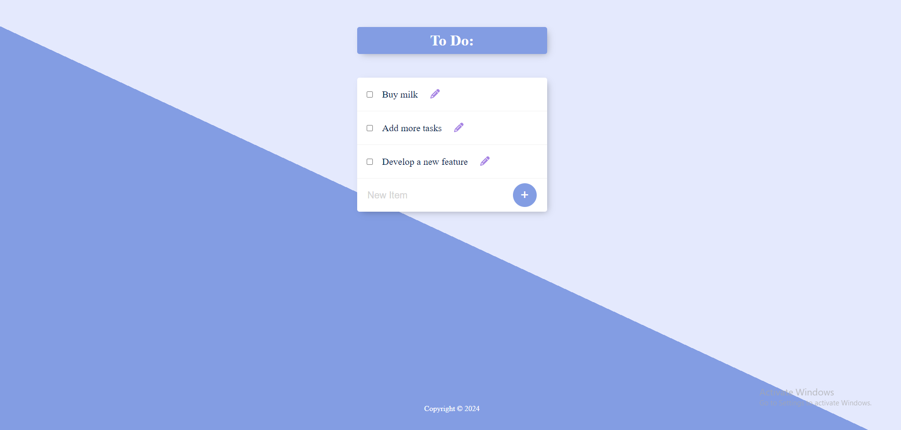

# To Do List



## Introduction
The "To Do List" is a simple web application that allows users to manage their daily tasks efficiently. This project demonstrates the use of modern web technologies to create a full-stack application for task management.

## Technologies
This project is created with:
- **Node.js**: A JavaScript runtime built on Chrome's V8 JavaScript engine.
- **Express**: A minimal and flexible Node.js web application framework that provides a robust set of features for web and mobile applications.
- **PostgreSQL**: A powerful, open-source object-relational database system that uses and extends the SQL language combined with many features that safely store and scale the most complicated data workloads.
- **EJS**: A simple templating language that lets you generate HTML markup with plain JavaScript.
- **Body-Parser**: A Node.js body parsing middleware used to parse the incoming request bodies in a middleware before your handlers, available under the `req.body` property.

## Features
- Add new tasks to the to-do list.
- View all the tasks in an ordered list.
- Edit existing tasks.
- Delete tasks from the list.

## Setup
To run this project, install it locally using npm:

```bash
$ git clone https://github.com/matbuha/ToDoList-NodeJS.git
$ cd ToDoList-NodeJS
$ npm install
$ npm start
```

### Configuring the Database
Ensure that PostgreSQL is installed and running on your system. Create a database named `permalist` and run the SQL script provided in the `database.sql` file to set up the required tables.

### Environment Variables
For security reasons, configure your database credentials and other sensitive data using environment variables. Create a `.env` file in the root directory of your project and add the following:

```plaintext
DB_USER=yourusername
DB_HOST=localhost
DB_DATABASE=permalist
DB_PASSWORD=yourpassword
DB_PORT=5432
```

Replace the placeholders with your actual database configuration.

## Usage
After starting the server, open `http://localhost:3000` in your web browser to view and manage your to-do list.

## Contributing
Pull requests are welcome. For major changes, please open an issue first to discuss what you would like to change.

Please make sure to update tests as appropriate.

## License
[MIT](https://choosealicense.com/licenses/mit/)
